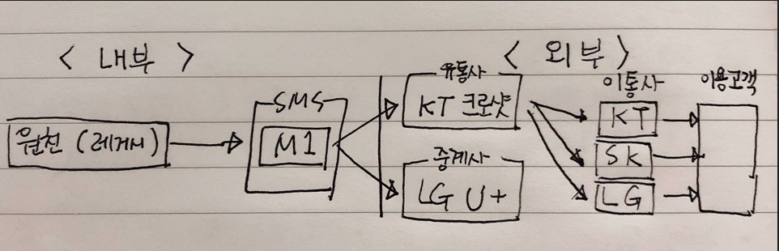
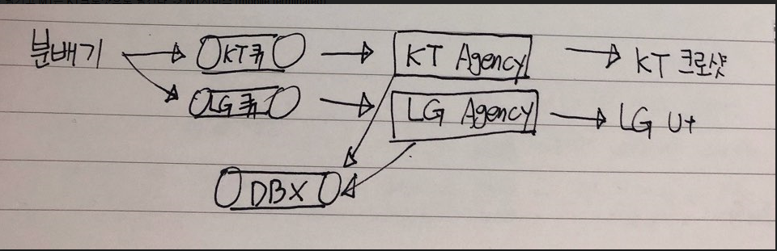

M1 데이터 처리 플로우
==================
</img>  
- 원천에서 M1으로 데이터를 넘기고 M1은 KT크로샷으로 넘긴다. -> MT서비스 (mobile terminated)  
- 고객이 데이터를 넘기면 유통사를 거쳐 내부로 오는 MT와 반대개념 -> MO서비스 (mobile oriented)  

- 데이터는 어디에서 오는지보다 어떠한 형태로 오는지가 더 중요하다.
- Push의 경우 이통사를 거치지 않고 바로 고객에게 넘어간다.

소프트웨어의 구성도
---------------
1. 접수 
2. 분배
3. 발송

-> M1의 핵심 코드는 C언어로, 기본 코드는 자바로 이루어져 있으며, 그 외에 고객사의 모든 업무 로직은 Freemarker 와 SQL 스크립트로 구현된다.
-> M1의 DB 테이블명은 숫자로 구분되어 00~61번까지 있다.

- 소켓 : DB가 작동하지 않아도 통신이 계속 유지되어 발송이 가능하다.
- ActiveShare : 서버 간 데이터를 실시간으로 공유하는 것.
- Tps : 초당 가능한 발송 건수 
- EAI : 데이터를 연동하여 식별자로 데이터를 식별 후 보낸다.

</img>  
분배기에서 보낸 데이터를 Agency로 넘기기 전에 Queue를 먼저 거친다.  
만약 KT에 메세지 100건을 전송했을 때 KT에 오류가 나면 분배기가 100건의 메세지를 자동으로 LG로 넘긴다. 
분배의 기준은 전화번호로 구분한다. 
데이터가 정상적으로 처리되었는지 확인을 위해 KT Agency와 LG Agency가 DBX라는 또 하나의 Queue로 확인 데이터를 보낸다. 

M1은 3000 tps의 성능을 가지고 있으며 만약 Agency들이 300tps 를 수용할 수 있는 경우, Agency를 10개로 추가, 조립이 가능하다. 