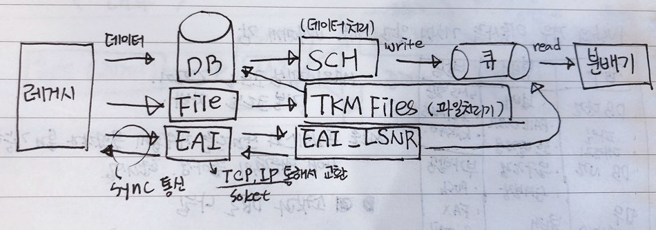
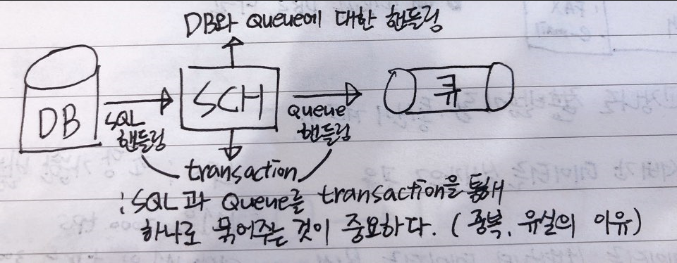
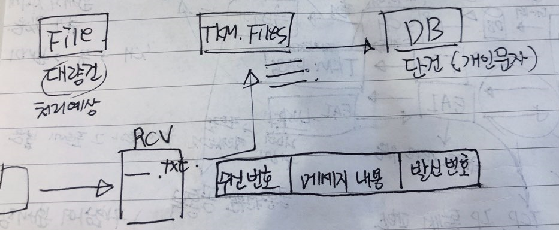
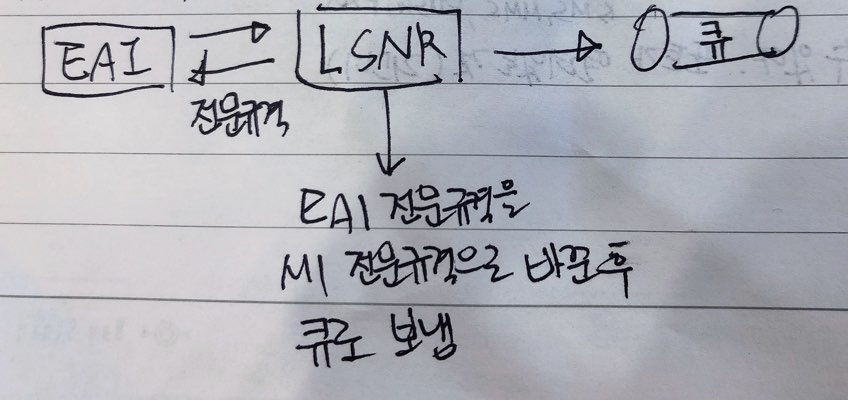
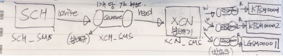
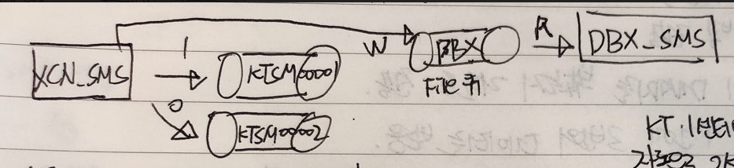
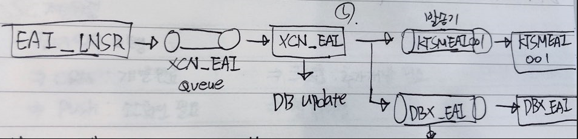

M1 구성 및 소개
==============
1. IPC (Inter-Process Communication)
	1. 프로세스들 사이에 서로 메모리(데이터)를 주고받는 행위이며 메모리, 세마포어, 소켓, 파일 등이 있다.
		- shared 메모리 : OS에 있는 메모리를 프로세스들이 서로 메모리를 공유하는 공간
		- 세마포어 : 공유하여 사용하는 자원의 문지기 역할. 접근을 제어한다.
 
- 프로세스가 shared 메모리를 사용 중일 경우 다른 프로세스는 끝날 때까지 기다리며 차례대로 진행한다.

- shared Queue :
1. 메모리큐는 shared 메모리와 세마포어를 사용한다.
2. 데이터가 메모리에 저장된다.

- File Queue :
1. 파일큐는 IPC 자원을 사용하지 않는다.
2. 데이터가 파일(디스크)에 저장된다.

| 구분 | 장점 | 단점 |
| ----------- | ----------- | ----------- |
| shared Queue | 빠르다 | 데이터의 휘발성 |
| File Queue | 안전하다 | 상대적으로 느리다 |

2. 접수 인터페이스  
</img>  
- EAI_LSNR (리스너, 수신기) : 포트를 열고있는 것. 클라이언트가 그 포트에 붙으며, 한 서버에 포트는 여러개일 수 있다.

분배기는 공통부와 개별부를 구별하여 분배한다.

	1. SCH  
</img>  
(상태 : 1. 대기 , 2. 요청 중, 3. 요청, 4. 결과완료)
- T41 : 발송테이블
	- DB T41 테이블 안에 상태와 시간 컬럼이 있는데, 시간에 맞는 상태가 1인 데이터만 발송하고 발송된 데이터의 상태는 2가 된다.  
	
	2. TKM_Files  
</img>  

	3. EAI  
</img>  

3. 분배 프로세스  
</img>  
Queue 에 데이터 190개까지 저장 가능하며, 190개가 다 찼을 경우 SCH에서 데이터를 보내지 않기 때문에 비워줘야한다.  
KT는 1센터 2센터 나뉘어 있기 때문에 2개이며, KT1센터에 문제가 발생하면 자동으로 2센터로 보낸다. -> 분배기능  
LG는 중계사가 있다.  
- XCN_real : 실시간업무 (ex. 입출금 등)
- XCN_batch : 일괄업무
- XCN_sms : SMS 업무

</img>  
보통 분배비율은 1:0으로 해둔다. 1센터에 문제가 생기면 바로 2센터로 보내지만 만약 2센터를 -1로 설정해두면 1센터에 문제가 생겨도 2센터로 보내지 않는다.  
</img>  
분배기가 발송기에 데이터 1개를 분배할 때 DBX에도 보낸다.  
T41엔 발송 완료된 데이터는 남기지 않으며, 발송 예정인 것만 남긴다.  
이미 발송된 건은 다른 테이블로 옮겨지게 되는데 그 처리를 DBX가 한다.  

- 중복체크  
메세지마다 key를 가지고 있으며, 이 고유 키로 중복을 구분한다.
- 발신번호  
사전등록분배기가 발신번호를 기억하고 있으며, 등록된 발신번호가 아니면 실패처리한다.

4. 발송 에이전트
DBX는 메세지 1건에  총 세 번의 데이터를 받는다.  
1. 데이터 전송
2. 피드백 전송
3. 고객이 메세지를 봤는지 리포트 전송

- 분배기가 보낼 때 -> Accept (insert, delete)  
- 중계사에서 받은 피드백 -> Ack (update)  
- 클라이언트의 메세지 수신 여부 -> Report (update)

