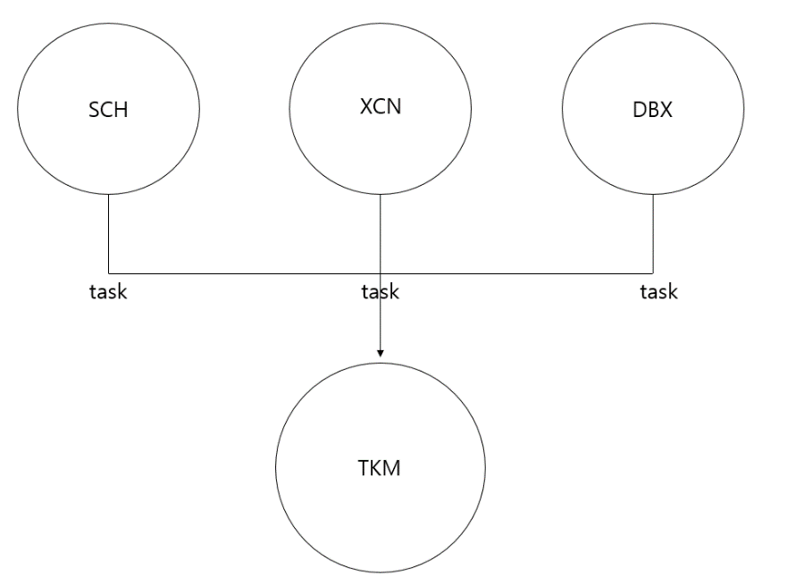

TKM과 FTL소개
=======================
테스크매니저(TKM)와 테스크(TASK)
-----------------------------------
</img>  
- TSKM = PROCCESS
- TASK = THREAD
 -TSKM는 TASK들을 하나로 모은 것으로 TASK들을 관리하며, 쓰레드를 마음 껏 뽑을 수 있다. (ex. 메인메소드)  
 
 
FTL (Freemarker Template Language)
------------------------------------
SQL의 데이터를 FTL에서 hash { : } 형태로 변환하여 Queue에 넣는다.  
유지보수에 좋다.  

1. 변수선언 및 형변환
	1. 변수선언 : <#assign /> 를 사용한다.
		- Ex) <#assign aa = “12345”/>
	2. 형변환 : 변환할 타입 앞에 ? 를 사용한다.
		- Ex) <#assign TEST1?String/>
			- ? 를 사용하면 결과값에 , 가 붙지만 ?c 를 사용하면 , 없이 출력된다.

2. if문
	1. <#if > 의 형태로 / 로 닫지 않는다. 또한 &&은 and, || 은 or 을 의미한다.
	2. <#if TEST??> 로 ??를 붙이면 TEST가 존재 하는지 안하는지를 의미하며, 그 반대로는 !TEST??를 사용한다.
	3. Asif 를 사용할 경우, <#asif      /#if> 형태로 닫아준다.

3. For문과 While문 
	1. <#list >를 사용하며 as 뒤에 변수를 둔다.
		- Ex) <#list 1….5 as i>  
			{i}    -> 변수 i를 사용

4. 주석 
	1. <-- comment -->

5. DB decode 
	1. (검사 값, 매칭 값, 결과 값, 매칭 값, 결과 값, 디폴드 값)으로 출력된다.  
	1. M1.now() 는 현재시간을 출력하는 것으로 프로그램이 실행되는 시간을 출력한다.  

6. HashMap
	1. <#assign values = {  
“key” : “value”  
}  
형식으로 사용하며, values에 추가할 값이 있을 경우,  
<#assign values = values + {“key” : “value”} …../> 형식으로 값을 추가한다.  
하지만, 이미 지정한 key값이 존재하고 있으면 value로 오버라이딩 된다.  

 
- If문 사용 시 부등호는 무조건 < 오른쪽으로 향하게 한다.
	+ trim :  앞,뒤 공백을 없애주는 것
	+ HashJoin : 맵끼리 합치는 것. 뒤에 있는 맵 기준으로 앞 맵을 덮어쓴다.